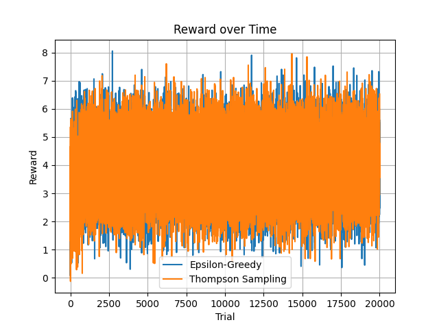
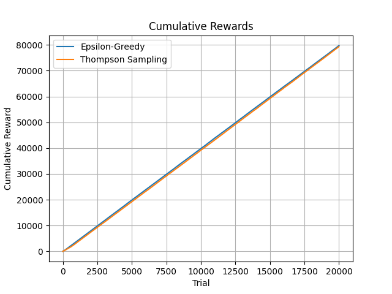

# DS223_HW2
# A/B Testing with Multi-Armed Bandits

This project implements two A/B testing strategies using the Multi-Armed Bandit framework:

- **Epsilon-Greedy**
- **Thompson Sampling**

It compares the performance of these algorithms based on cumulative rewards and regrets across 20,000 trials.

---

## 📁 Project Structure

<pre lang="markdown"> 
``` DS223_HW2/ 
├── Bandit.py - ✅ Main implementation 
├── plot1.png - ✅ Reward over time plot 
├── plot2.png - ✅ Cumulative reward plot 
├── README.md - ✅ Documented project overview 
├── requirements.txt - ✅ Dependencies 
├── rewards.csv - ✅ Output data 
└── venv/ - ✅ Virtual environment ``` 
</pre>
---

## 📊 Algorithms Implemented

### Epsilon-Greedy
- Starts with high exploration, gradually decays epsilon by `1/t`.
- Selects either the best-known arm or a random arm.

### Thompson Sampling
- Uses Gaussian priors with known precision.
- Selects the arm based on posterior sampling.

---

## 📈 Visualizations

1. **plot1.png** — Rewards over time.
2. **plot2.png** — Cumulative rewards comparison.

---

## 📦 Installation

1. Create a virtual environment:
   ```bash
   python -m venv venv
   venv\\Scripts\\activate   # On Windows
   ```

   ```bash
   python3 -m venv venv
   source venv/bin/activate # On macOS, Linux (Terminal)
   ```

2. Install the dependencies:

   ```bash
   pip install -r requirements.txt


3. Run the Project

   ```bash
   python Bandit.py 


---

## 📊 Results

After running both algorithms over 20,000 trials using the reward distribution `Bandit_Reward = [1, 2, 3, 4]`, here are the results:

### 🔢 Final Metrics

[EpsilonGreedy] Average reward: 3.9867 [EpsilonGreedy] Cumulative regret: 265.5306

[ThompsonSampling] Average reward: 3.9668 [ThompsonSampling] Cumulative regret: 664.8715

---

### 📉 Reward Over Time

This plot shows how the reward fluctuates over time for both algorithms.



---

### 📈 Cumulative Rewards

This plot visualizes the total reward accumulated over 20,000 trials.



---
